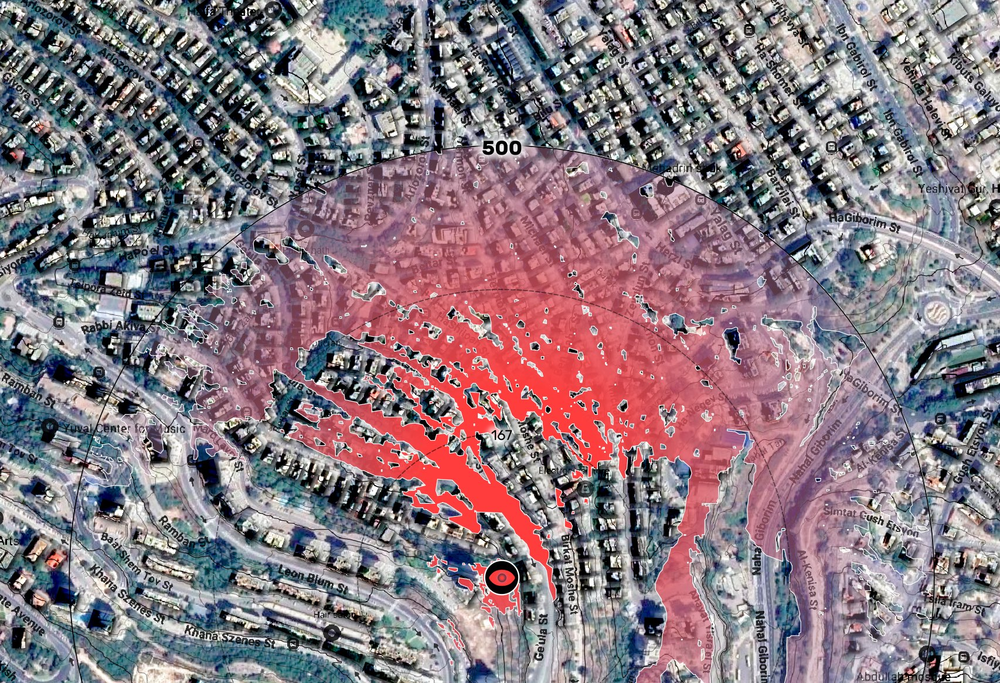
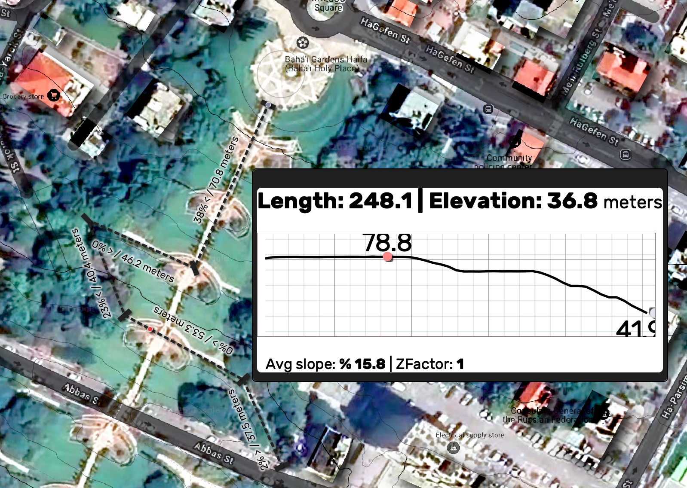

# Contact me

For any questions, bug reports and any comment or improvements suggestion, please write me at
[Erez.sg@gmail.com](mailto:Erez.sg@gmail.com). 
 

 

# Common startingPoint

This QGiS project is a go-to **startingPoint** for new projects. Built with ready made project's settings, styling and easy to use tools and functions embbeded in project's variables and Expression engine.

<ins>**Important:**</ins>

**Enabling of macros is needed for tools to work**  
**DEM Layer of the area is needed for terrain analysis tools**

## Groups and layers

Project's layers-tree is built to keep focus on the user's **working layers** while structuring styled and improved **background** imagery and also keeping easy access to the **Tools and draft** layers group. 
> **Layers** group is used to store your project's working layers, which you would usually toogle through often, separately from more basic and stationary layers.

> **Background** is combined from different layers styled using blend modes to create an improved background imagery.
>
> - **Topo** - Constructed only from the project's DEM layer styled to show contour lines
> - **Landuse** -  OSM Buildings and Water vector tile layers, styled to contrast these surfaces from others without hiding or loosing orophoto's details
> - **Google labels only** - Raster layer showing only google map's labels to easily get worldwide basic orientation. Layer is also used to darken roads, further versions may use other OSM vector tiles to create this effect
> - **Orto** - Ortophoto imagery (deafaulted to google setallite) 
>
>  Notice: DEM layer is essential for several tools to work so it's strongly advised to name any new elevation model layer as 'DEM' or alternatively, changing this layer's datasource to your own local DEM file
>
> 
> </img>

Also you have **Tables & Data** group to store non-spatial data.

## Drafts & tools 

The last group called **Drafts & tools** is made out of [temporary scratch layers](https://docs.qgis.org/3.34/en/docs/user_manual/managing_data_source/create_layers.html#creating-a-new-temporary-scratch-layer) for Points, Lines and Polygons that can be used as drafts. Each layer can also be used for spatial investigations of your project with quick analysing tools.
Scripts and data links for these purposes are allready embedded in each layer's styling rule so you can start easily start just by adding a new feature to that layer. That's the reason they're also reffered to as tools:

> ### Points layer:
>
> - **Point** - For drafts, just showing your points with no calculations
>
> - **MeasureRadius** - Shows the value of the feature's "Radius" field around your point.
>
> - **ViewShed** - Shows the claculated viewshed of a viewer standing at that point within the calculated radius.
>
>  **Viewer and target height are defined as layer's variable and can be changed easily, but can't be set separately for each point 

> ### **Lines** layer:
>
> - **Line** - For drafts, automatic calcuations made for a C-section display
>
> - **Buffer** - Shows the value of the feature's "Buffer" field as a buffer around that line
>
> - **Distance & Avg. slopes **- Show each segment's length and calculated avgerage slope and direction
>
> - **Min Max** - Calculate and shows line's minimum and maximum points
>   
> - **C-Section mapTip** - Hover with your mouse on each line to display it's calculated C-Section using mapTip 

> ### Polygons layer:
>
> - **Measures** - Using *Klas Karlsson's* 'Polygons with measurments', this show the measures for all polygon's segments 
> - **Intersects others** - Showing the area of intersection of your polygon with another layer and it's calculated size. To choose the layer you want to intersect insert it's name to the feature's "Layer2Intersect" field
>
> - **Intersection group by mapTip** - Shows the aggregated sum of areas intersecting your polygon grouped by categories found on a choosen "GroupByField"

</img> </img> </img>

## Ready made settings and scripts

The **startingPoint** file is using project's variables save default scripts and give easy access to them using eval(@ScriptName) on any QgsExpressionEngine.

> - **@Font** - Easly set and change font settings for all layers,layouts and labels by using this variable when styling of new objects and layers
>
> - **@Color1, @Color2** - Basic project colors used as deafults
>
> - **eval_template(@CSS)** - This is a more complex set of ready-made CSS properties (Using the @Font variable  as input). Useful for automatic and unified styling of your html scripts and snippets such as mapTip, Html labels etc
>
> - **eval( @Feat2Html ) ** - Use this script to turn your feature into an Html table. To control styling of different features use layer's variables such as:
>   - **HeaderField** - Insert a field name to use it as a header before the table
>   - **HideFields** - Insert field names for fields you don't want to be included in your table, separate field names with a comma
>   - **TopFields** - Fields to place on top of the table with their desired order. Other fields will show at the table's bottom with smaller text and in dimgray color
>   - **LinkFields** - Fields containing links will use the field's name as a hypertext with field's value as url
>   - **ImageFields** - Will be displayed as images, using field's data as image's url. Images are shown on bottom of the page outside the table

</img>

## Project settings and Macros

### Macros 
Project's macros define 3 new @qgsfunction methods that are accessiable in your ExpressionEngine and are nested under a new group named **Common**
> - **C_ViewShed** - Calculates a viewshed using a point geometry, DEM layer, radius and target observer heights. Gives back a polygon representing visible areas
> - **C_Json2Sqlite2Json** - Creates an sqlite3 (memory) table from a structured json stream (all json features must have the same keys at the same order) named 'data'. The method then runs any SQL query over this data and returns it's result as a structured json stream.
> - **C_Json2Html** - Gets a structured json stream (again all features must have the same keys at the same order) and returns an html table with json keys as table's headers. A dictionary with keys and their aliases could be supllied too control display of headers and their order. Also a CSS string can be given to be insert as an inline CSS for the < table > tag

### Project settings
Defualt styling setting are saved for new Polygons, Lines and Points. Newer versions may include styles and colors to support better workflows.

  * Notice: Polygons are colored with embbeded scripts that should be cleared or deactivated to sucessfully change their colors manually 

